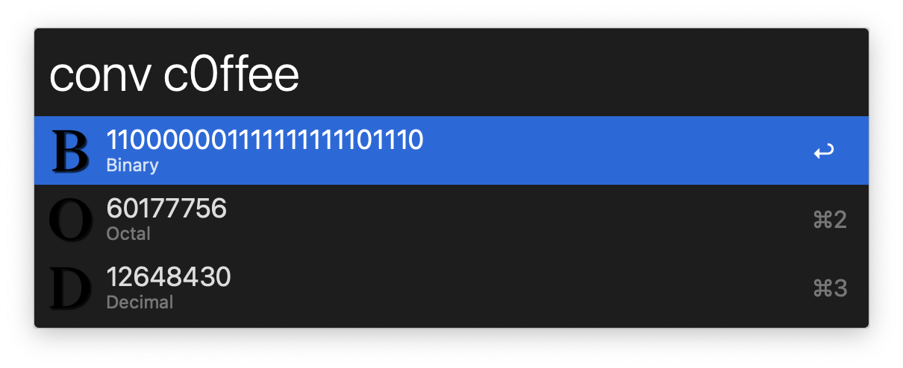
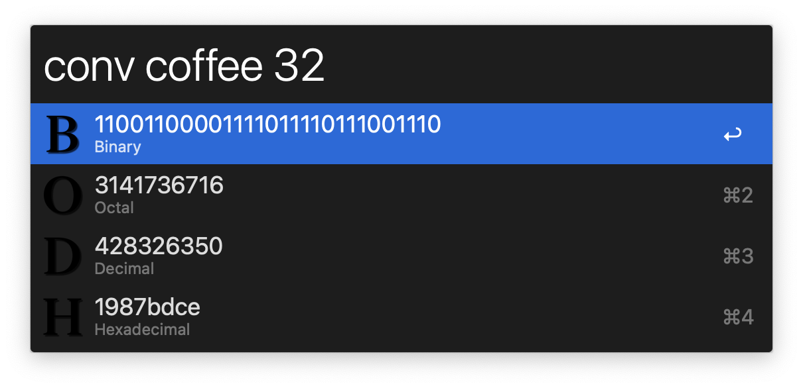

# Numbers Converter for Alfred

[](https://github.com/knutwalker/alfred-numbers-converter/actions?query=workflow%3Abuild)
[](https://github.com/knutwalker/alfred-numbers-converter/releases/latest)

## Alfred workflow to convert numbers

## Usage

`conv <number> <base?>`



Using `conv <number>` will convert the number from base10 to bases 2, 8, and 16.
Generally, it will convert numbers from any base to bases 2, 8, 10, and 16.

### Specifying the base

- Hex is automatically chosen if the number cannot be parsed as base10
- Prefix the number with `0b` for base2, `0o` for base8, `0x` for base16
- Provide the base explicitly with a second argument:
    - Possible values include `binary`, `decimal`, `octal, `hexadecimal`
    - Or any string that is a prefix of one of these
    - A number where `2 <= base <= 36`




## Installation

### Pre-packaged

Grab the latest release from
[the releases page](https://github.com/knutwalker/alfred-numbers-converter/releases).

The release contains a binary of this workflow and macOS will quarantine this binary.
To mark it as trusted, use the GUI workflow via the Preferences pane or run

```sh
xattr -c ~/Downloads/numbers-converter-*-apple-darwin.alfredworkflow
```

### Building from source

#### Rust

The workflow is written in Rust, an installation from source requires a Rust toolchain to be installed.
The easiest way is to open [rustup.rs](http://rustup.rs/) and follow their instructions.

Some package managers, e.g. apt on Linux, homebrew on macOS, chocolatey on Windows, may offer their own packages to install Rust.
It is nevertheless prefered to us the rustup installer so that multiple toolchains can be managed.

##### Minimal required Rust version

`alfred-numbers-converter` requires at least Rust `1.58.1` and works on the stable toolchain.
If you have installed rustup as mentioned above, no further actions are required.
If you have installed Rust in some other way, you need to make sure that the correct toolchain is selected.
You can verify your Rust version by using the command `rustc --version`.

#### Powerpack

The easiest way to package and use the workflow from the source is by using [powerpack](https://github.com/rossmacarthur/powerpack).

```sh
cargo install powerpack-cli
```

To build the workflow:

```
# cd alfred-numbers-converter
powerpack package
```

The workflow will be in `target/workflow/`.

In order to directly use the workflow from the sources:

```sh
powerpack build --release
powerpack link
```


License: MIT OR Apache-2.0
